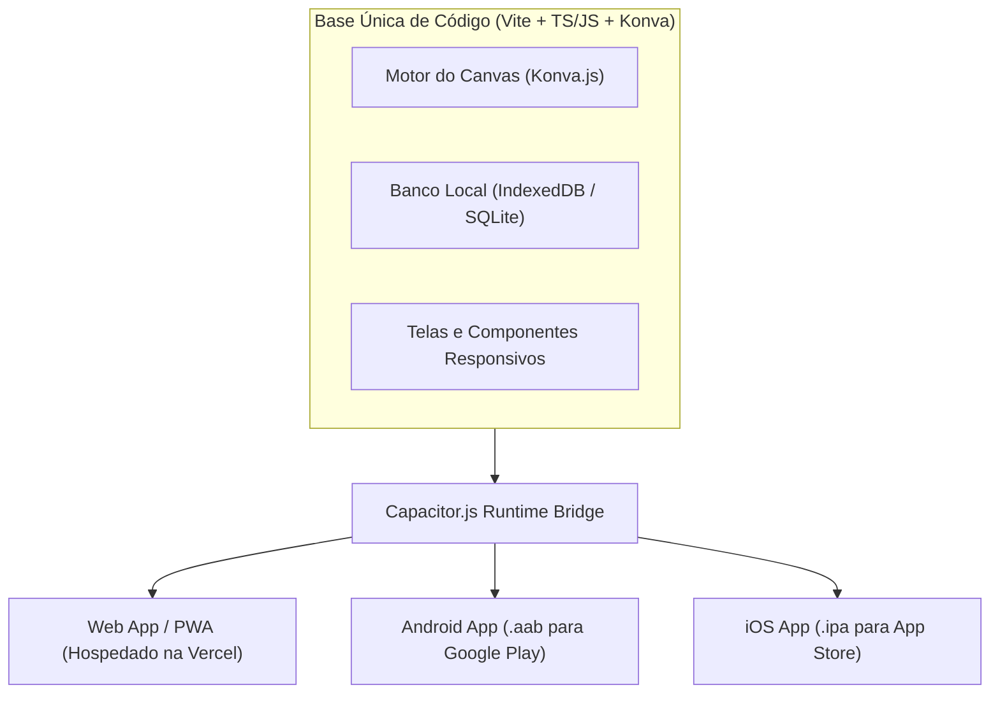
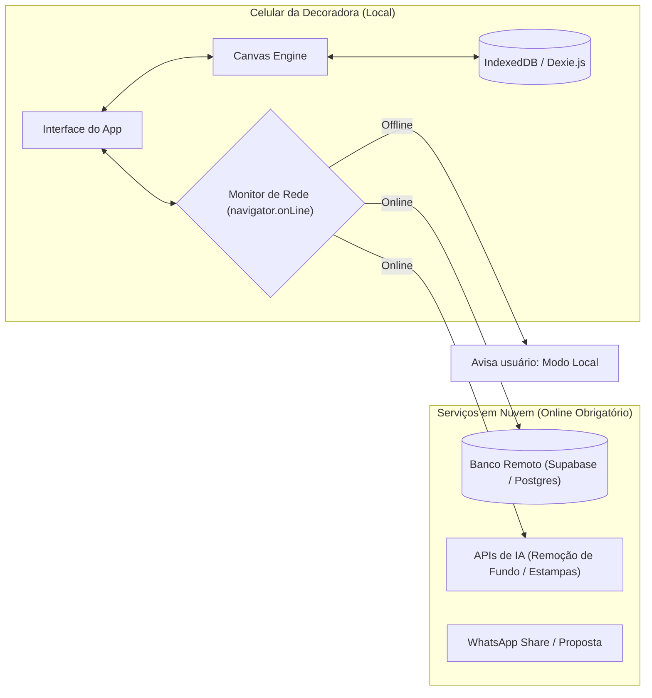
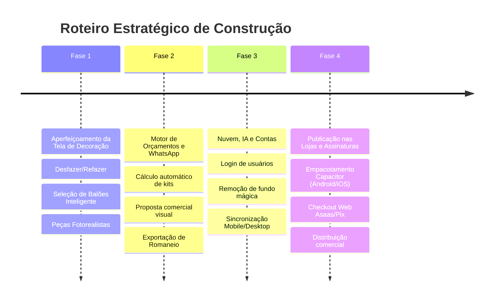

# Planejamento Estratégico & Arquitetura Técnica — Minha Festa

> **Documento de Engenharia de Produto & Visão de Negócio**  
> **Autor:** Gabriel Azevedo & Antigravity  
> **Data:** Outubro de 2026  
> **Status:** Aprovado para Planejamento de Longo Prazo  

---

## 1. Stack Tecnológica: O Presente e a Transição para App Nativo

### 1.1. Faz sentido continuar com HTML, CSS e JavaScript?
**Sim, para o Motor Gráfico; Não, para uma aplicação complexa com CRM e Agenda se mantida em Vanilla puro.**

* **O Canvas (Konva.js):** O que construímos no Canvas é HTML5 Canvas 2D nativo. Essa matemática (máscaras de recorte para cilindros, rotação, proporção métrica, camadas e exportação HD) roda em qualquer plataforma: na Web, no Android e no iOS. Essa base é sólida e não precisará ser reescrita.
* **O Risco do Vanilla JS na Casca de Telas (UI):** Conforme você adicionar telas de cadastro de clientes, relatórios financeiros, agenda com múltiplos status e orçamentos dinâmicos, manipular o DOM manualmente com `document.getElementById` e `innerHTML` gerará o clássico "código espaguete".
* **A Recomendação Técnica:**
  1. Manter a arquitetura modular com Vite.
  2. Adotar **TypeScript** progressivamente. A tipagem estática (`interface Item`, `interface Project`, `interface Budget`) é a maior garantia de que um programador humano entenderá e refatorará o código no futuro com zero medo de quebrar o sistema.
  3. Manter o motor de Canvas desacoplado da interface gráfica.

### 1.2. Como transformar isso em um aplicativo real para Play Store e App Store?
Você **NÃO precisa reescrever o app em Kotlin/Swift**. A tecnologia padrão da indústria para levar esse código para as lojas mantendo uma base única é o **Capacitor.js** (criado pelos criadores do Ionic).



* **Vantagens do Capacitor:**
  * Gera projetos nativos reais no Android Studio e Xcode.
  * Dá acesso a plugins nativos: Câmera, Galeria de Fotos, Compartilhamento nativo de arquivos e Armazenamento em SQLite criptografado.
  * O mesmo código que roda na web roda no iPhone e no Android.

---

## 2. Estrutura Comercial, Jurídica e Lojas de Aplicativos

### 2.1. O Labirinto das Lojas: Google Play e Apple App Store
* **Google Play Store (Android):**
  * Taxa única de **$25 USD** para registro de conta de desenvolvedor.
  * *Atenção à nova regra do Google:* Contas pessoais criadas recentemente exigem **teste fechado obrigatório com 20 testadores por 14 dias contínuos** antes de receber aprovação para publicação aberta.
* **Apple App Store (iOS):**
  * Anuidade de **$99 USD/ano**.
  * Processo de revisão rigoroso (rejeitam apps com bugs visuais, links quebrados ou que pareçam apenas "um site empacotado"). Para aprovar na Apple, o app precisa usar gestos fluidos e animações nativas.

### 2.2. A "Taxa Apple/Google" de 15% a 30% e a Estratégia de Pagamentos
Se você cobrar assinaturas (SaaS) dentro do app através do Google Play Billing ou Apple In-App Purchases, as lojas ficam com **15% a 30% da sua receita bruta**.

> [!IMPORTANT]
> **A Estratégia dos Grandes SaaS (Web Checkout First):**
> Em vez de processar pagamentos dentro das lojas da Apple/Google, você opera como um **SaaS Multiplataforma B2B**:
> 1. O pagamento e a assinatura são processados **na Web** (via gateway brasileiro como **Asaas, Mercado Pago ou Stripe**), com cobrança via **Pix automático, boleto ou cartão de crédito**.
> 2. As taxas no Asaas/Pix ficam entre **0,99% e 2,99%** (contra 15% a 30% da Apple/Google).
> 3. No aplicativo móvel, a decoradora apenas faz o login com seu e-mail e senha.

### 2.3. Pessoa Jurídica (MEI vs. ME)
* **A Realidade Fiscal:** A atividade de desenvolvimento de software sob encomenda ou licenciamento de software (SaaS) é enquadrada nos CNAEs 6201-5/01 e 6203-1/00. Pela legislação brasileira, essas atividades intelectuais **não constam na lista permitida do MEI**.
* **Como os fundadores começam:**
  * *Fase de Validação (MVP):* Testar e receber primeiros pagamentos como pessoa física ou MEI transitório usando atividade correlata de apoio administrativo.
  * *Fase Comercial (Tração):* Abrir uma **ME (Microempresa)** optante pelo **Simples Nacional no Anexo III** (com benefício do Fator R via pró-labore), pagando alíquota inicial reduzida de aproximadamente **6% sobre a nota fiscal**.

---

## 3. Arquitetura de Conexão: Local-First (Online/Offline)

Para que a decoradora possa usar o app dentro de um salão de festas sem sinal de 4G, a aplicação deve seguir a filosofia **Local-First**.



### Matriz de Recursos:

| Funcionalidade | Funciona Offline? | Depende de Conexão? | Tratamento de UX |
| :--- | :---: | :---: | :--- |
| **Montagem no Canvas** | Sim (100%) | Não | Sem travas. Roda liso no hardware do celular. |
| **Cálculo de Orçamento** | Sim (100%) | Não | Matemática puramente local baseada no acervo. |
| **Exportação de Imagem HD** | Sim (100%) | Não | Renderizado localmente via Canvas API. |
| **Biblioteca de Peças Salvas**| Sim (100%) | Não | Fotos cacheadas localmente no IndexedDB. |
| **Remoção de Fundo por IA** | Não | **Sim** | Botão exibe aviso: *"Requer conexão com a internet"*. |
| **Geração de Capas por IA** | Não | **Sim** | Desativa com mensagem explicativa se offline. |
| **Sincronização Celular/PC** | Não | **Sim** | Fila de sincronização automática ao reconectar. |

---

## 4. Integração de Inteligência Artificial

A IA não deve ser uma "perfumaria", mas sim uma ferramenta para economizar horas de trabalho manual da decoradora.

### 4.1. Remoção de Fundo Inteligente (A maior dor das fotos reais)
A decoradora tira foto de um vaso ou cilindro na garagem dela. A foto vem com chão, parede e objetos aleatórios atrás.
* **Solução Híbrida Inteligente:**
  1. **No Navegador / Celular (Custo R$ 0,00):** Usar bibliotecas WebAssembly baseadas em modelos modernos leves (como `@imgly/background-removal` ou modelos ONNX RMBG-1.4). Roda direto na GPU do celular do usuário sem gastar 1 centavo de API em nuvem!
  2. **Em Nuvem (Alta Definição para bordas finas):** Chamar uma API como *Photoroom API* ou *BiRefNet* via proxy seguro apenas quando o usuário solicitar qualidade ultra.

### 4.2. Geração de Capas e Painéis Temáticos
* A decoradora digita: *"Tema Floresta Encantada com aquarela verde oliva e bichinhos dourados"*.
* Uma API de geração de imagem (Google Imagen 3 via Gemini API ou FLUX) gera a arte em alta resolução já formatada no gabarito circular ou cilíndrico.

> [!WARNING]
> **Regra Crucial de Segurança:**
> **NUNCA armazene chaves secretas de APIs de IA no frontend.** Se a chave estiver no código JavaScript do celular, qualquer usuário mal-intencionado pode inspecionar e usá-la, gerando cobranças milhares de dólares no seu cartão.
> Todas as chamadas de IA devem passar por um **Backend Serverless Leve** (Vercel Serverless Functions ou Cloudflare Workers) que valida se o usuário tem uma assinatura ativa antes de disparar para a OpenAI/Google.

---

## 5. Engenharia de Código: Autonomia Humana vs. IA

O seu receio de "ficar refém da IA" ou criar um código que nenhum programador humano consiga manter é um dos maiores riscos em projetos gerados por LLMs.

### 5.1. Regras de Blindagem do Código (Clean Architecture):
1. **Desacoplamento em Módulos Isolados (Single Responsibility):**
   * `src/core/canvas-engine.js`: Cuida **apenas** do palco, nós e matemática de renderização. Ele não sabe o que é um botão HTML e não sabe o que é uma requisição HTTP.
   * `src/core/pricing-engine.js`: Cuida **apenas** da matemática de somar valores, aplicar descontos de kits e gerar o romaneio.
   * `src/core/db.js`: Cuida **apenas** de persistir dados no banco local.
   * `src/ui/`: Cuida da parte visual. Se amanhã você trocar o visual de uma tela, o motor do canvas e o banco continuam intactos.
2. **Zero Números Mágicos:**
   * Nada de colocar `1080` ou `640` solto no meio do código. Tudo deve ser uma constante declarada no topo do módulo com comentário claro:
     ```javascript
     export const SCENE_CONFIG = {
       VIRTUAL_WIDTH: 1080,
       VIRTUAL_HEIGHT: 1920,
       WALL_HEIGHT: 1380,
       FLOOR_HEIGHT: 540
     };
     ```
3. **TypeScript como Ferramenta de Documentação Viva:**
   * A migração para TypeScript força você e a IA a definirem os tipos de cada dado:
     ```typescript
     export interface DecorItem {
       id: string;
       name: string;
       rentalPrice: number;
       widthCm: number;
       heightCm: number;
       previewUrl: string;
       category: 'paineis' | 'cilindros' | 'mesas' | 'acessorios';
     }
     ```
   * Isso impede que uma IA invente campos novos no meio do código e quebra erros antes mesmo de rodar o aplicativo.

---

## 6. O Roteiro Recomendado de Evolução



1. **Fase Atual (Refinamento da Tela do Cenário):** Deixar a experiência de montagem impecável no celular e no computador (desfazer/refazer, arco de balões dinâmico com troca de cores, seleção precisa sem bloqueio invisível e peças hiper-realistas).
2. **Fase Comercial Rápida:** Adicionar cálculo de preço na hora e proposta formatada com WhatsApp para validar clientes reais e faturar.
3. **Fase de Escala (Nuvem e IA):** Adicionar autenticação com banco remoto e ferramentas de inteligência artificial.
4. **Fase de Distribuição (Lojas):** Empacotar com Capacitor para Play Store e App Store.
